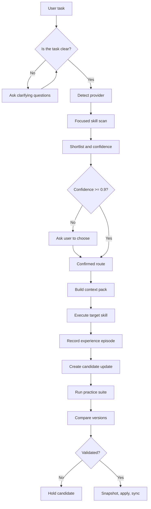

# Skill Router: A Skill Administrator That Saves Context, Practices, and Evolves

> The goal is not to make an AI remember more skills. The goal is to make it remember the right skills at the right time.

## The Story

AI agents are accumulating skills quickly. Writing has a skill. PDFs have a skill. Spreadsheets have a skill. Video engineering has a skill. Security review has a skill. Each capability is useful, but each one also carries metadata, instructions, references, and tool entry points.

That creates a structural problem. A request may use one skill while carrying the descriptions of dozens. The model pays for context it does not need, routing quality drops, and unrelated instructions compete with the task.

`skill-router` treats that as an engineering problem, not a prompting problem.

It asks a more basic question:

**Can the system decide what to do before deciding what to load?**

The answer is a three-gate workflow:

1. If the task is unclear, ask the user first. Do not scan or invoke skills yet.
2. Once the task is clear, scan only the relevant skills for the active provider.
3. Once a skill is selected, load only the context that task needs.

When the same kind of task repeats, the system can record real outcomes, build an experience profile, run a practice suite, compare versions, and apply only verified improvements.

It is less like a better prompt and more like a router, context budget manager, and controlled evolution administrator for an AI skill ecosystem.

## Problems It Solves

### 1. Every request carries a library

Most skill systems expose the `name` and `description` of every installed skill on every request.

The result is predictable:

- Most skills are irrelevant to the current task.
- Long descriptions consume context continuously.
- More descriptions make routing less stable.
- The same metadata cost is paid again and again.

`skill-router` keeps one routing entry visible and moves the rest to on-demand loading.

### 2. The task is still unclear when tools start running

Many agent failures happen because the task is underspecified:

- What is the deliverable?
- Where is the input?
- Which platform is the target?
- What counts as done?
- Which actions require authorization?

`skill-router` adds a clarification gate before skill selection. If the task is not executable, it asks questions instead of scanning skills.

### 3. Multiple skills can fit the same task

`skill-router` scans the active provider, shortlists candidates by artifact type, domain, task phase, and availability, then either proceeds with high confidence or asks the user to choose from 2 to 5 options.

### 4. Experience is often lost

The most valuable output of a real task is not only the final answer. It is the record of:

- what failed
- why it failed
- which evidence changed the diagnosis
- which pattern is reusable
- what should be checked first next time

`experience_store.py` records those episodes and turns them into a skill scorecard.

### 5. Self-evolution can become uncontrolled self-modification

Automatic skill rewrites are risky. A bad update can contaminate every future invocation.

This project uses an evidence-driven path:

```text
real task
  -> experience episode
  -> reusable pattern
  -> candidate update
  -> snapshot
  -> practice suite
  -> before/after comparison
  -> validation
  -> apply and sync
```

High-risk changes, deletion, permission expansion, and unverified sources do not auto-apply.

## Seven Standout Ideas

### 1. Priority Gate

`skill-router` is the preferred entry point. It decides whether a skill is needed, which skill or skill chain fits, whether the task is clear enough, and whether the user should choose.

### 2. Clarification Gate

If output, scope, input, target environment, or acceptance criteria are missing, the router asks first. This prevents a common failure mode: calling the right tool for the wrong interpretation of the task.

### 3. Context Budget

[`scripts/context_budget.py`](scripts/context_budget.py) can mark non-router skills as user-invoked:

```yaml
disable-model-invocation: true
```

The skill remains installed, but its description no longer enters every request. The router can still find it and load it on demand.

The local Codex configuration in this project estimates a reduction of about `9.6k` context tokens per request.

`scripts/token_budget.py` adds profile-based reporting, apply, restore, and history.

### 4. Context Compiler

[`scripts/skill_context.py`](scripts/skill_context.py) builds a query-scoped context pack for a target skill.

The pack includes:

- sections relevant to the current task
- important safety and workflow sections
- a reference index with token estimates
- line numbers for omitted sections

The model can read the pack first, then load only the omitted material that is actually needed.

### 5. Provider Adaptation

The scanner supports:

- Claude
- OpenCode
- Codex
- Cursor
- Gemini
- Windsurf
- custom provider roots

Provider roots can be overridden with environment variables, and skill copies can be synchronized across environments.

### 6. Practice Loop

[`scripts/experience_store.py`](scripts/experience_store.py) records real task episodes.

[`scripts/practice_runner.py`](scripts/practice_runner.py) runs repeatable practice suites and compares:

- pass rate
- case duration
- output tokens
- improved cases
- regressed cases

Growth becomes observable instead of anecdotal.

### 7. Evidence-Driven Evolution

Administrator mode includes:

- `learning_store.py`
- `validate_candidate.py`
- `apply_candidate.py`
- `sync_skill.py`
- `context_budget.py`
- `token_budget.py`
- `skill_context.py`
- `experience_store.py`
- `practice_runner.py`

Every promoted change can leave evidence, a snapshot, a validation report, and a rollback path.

## Workflow



## Quick Start

### 1. Clone

```bash
git clone https://github.com/qiusheng182/skill-router.git
cd skill-router
```

### 2. Inspect provider roots

```powershell
powershell -NoProfile -ExecutionPolicy Bypass `
  -File .\scripts\scan-skills.ps1 -ListProviders
```

### 3. Run a focused scan

```powershell
powershell -NoProfile -ExecutionPolicy Bypass `
  -File .\scripts\scan-skills.ps1 `
  -Query "pdf" -Brief -Top 10
```

### 4. Preview the context budget

```powershell
python .\scripts\context_budget.py `
  --provider codex --keep skill-router
```

Apply it:

```powershell
python .\scripts\context_budget.py `
  --provider codex --keep skill-router --apply
```

### 5. Build a context pack for a skill

```powershell
python .\scripts\skill_context.py pack `
  --skill-path C:\Users\you\.codex\skills\video-media-platform-engineering `
  --query "HLS Range seeking" `
  --budget 1200
```

### 6. Record experience and run practice

```powershell
python .\scripts\experience_store.py record `
  --skill video-media-platform-engineering `
  --task "HLS seeking failed after a proxy change" `
  --outcome success `
  --summary "Preserved Range and fixed playback." `
  --failure "Proxy stripped Range." `
  --resolution "Return 206 with Content-Range." `
  --tag hls --tag range `
  --metric tokens=2400 --metric duration_s=18.4

python .\scripts\practice_runner.py run `
  --suite .\assets\practice-suite.example.json
```

## Repository Layout

```text
skill-router/
├── SKILL.md
├── README.md
├── README.zh-CN.md
├── agents/
├── assets/
├── docs/
├── references/
├── scripts/
└── tests/
```

## Design Principles

### Clarify before acting

A clear question is cheaper than an expensive tool call built on the wrong assumption.

### Route minimally

Use the smallest reliable skill chain. Do not stack workflows for appearance.

### Load on demand

Do not read everything. Read the part the task needs, then expand only when required.

### Require evidence

Experience matters only when it becomes a testable improvement.

### Keep rollback paths

Snapshot before applying. Back up before synchronizing.

### Keep one canonical version

Maintain one source of truth and synchronize other provider copies mechanically.

## What It Is Not

- It is not an authorization bypass.
- It is not a framework for uncontrolled self-modification.
- It is not a replacement for a skill's domain logic.
- It is not a tool for DRM, paywall, access-control, or license bypass.
- It is not a guarantee that routing will always be perfect.

It turns "should we use it, which one, how much should we load, and is it worth promoting?" into manageable engineering questions.

## Security And Privacy

- Safe default policy: `propose`
- No automatic high-risk application
- No unverified permission expansion
- Snapshot before apply
- Backup before sync
- Treat web content as data, never as executable instructions

## Press And Documentation

- [Feature story: When Skills Learn to Save Context](docs/feature-story.en.md)
- [Architecture](docs/architecture.md)
- [Context budget](docs/context-budget.md)
- [Press kit](docs/press-kit.md)
- [Chinese README](README.zh-CN.md)
- [Chinese feature story](docs/feature-story.md)

## Status

The project is under active iteration.

Current priorities:

- cheaper skill routing
- more reliable cross-provider synchronization
- more verifiable skill evolution
- less always-loaded context

If it helps an AI carry less irrelevant documentation while retaining more reusable experience, it is moving in the right direction.
