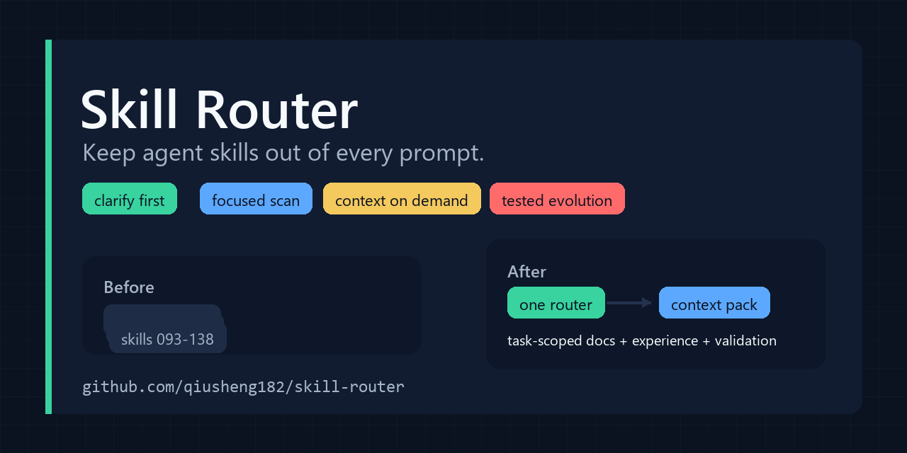
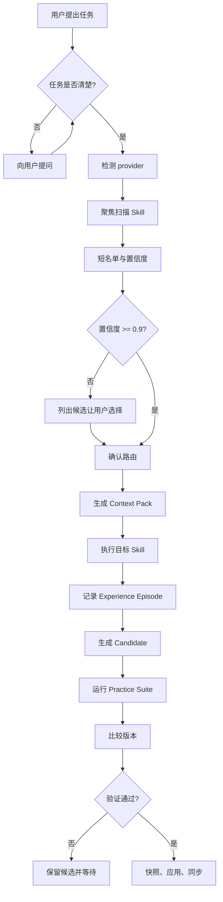

# Skill Router：一个会节省上下文、会练习、也会进化的 Skill 管理员



[](https://www.python.org/)
[](SKILL.md)
[](docs/context-budget.md)
[](https://github.com/qiusheng182/skill-router/stargazers)

> 不是让 AI 记住更多技能，而是让它在正确的时间，只记住正确的技能。

`skill-router` 面向 Skill 数量已经超过提示词承载能力的 Agent 构建者：
只保留一个常驻路由入口，只扫描相关信息，按需编译上下文，并用证据推动
Skill 进化，而不是让模型无约束地改写自己。

如果它帮你省下了真实上下文成本，欢迎点一个 star，让更多 Agent 构建者
能找到它。

## 20 秒看懂它做什么

- 任务不完整时，先澄清，再扫描或调用 Skill。
- 为当前 provider 路由到最小可靠 Skill 链。
- 把非路由 Skill 的 description 移出常驻上下文。
- 为当前任务编译 context pack，而不是加载全部参考资料。
- 记录经验、运行练习、验证变更，并保留回滚路径。

## 导语

AI Agent 的能力正在迅速增长，但上下文不是免费的。

当一个工具安装了上百个 Skill，每一次请求都可能携带大量无关的元数据：描述、触发词、使用说明、参考文档、脚本入口。真正被用到的可能只有一个，但所有内容都在参与成本。

`skill-router` 想解决的不是“再加一个 Skill”，而是一个更基础的问题：

**能不能先判断要做什么，再决定该加载什么？**

它把 Skill 使用拆成三道门：

1. 任务不清楚，先问人，不扫描 Skill。
2. 任务清楚后，只扫描当前 provider 中相关的最小集合。
3. 选中 Skill 后，只加载当前任务需要的上下文。

如果任务重复出现，它还能把真实执行结果记录下来，形成经验、练习集和版本对比，再把可验证的改进写回 Skill。

它不是“更聪明的提示词”，更像一个面向 AI Skill 的路由器、节流器和进化管理员。

## 它解决的真实问题

### 1. 每轮请求都背着一整座图书馆

传统做法是让模型看到所有 Skill 的 `name` 和 `description`。

问题是：

- 大多数 Skill 和当前任务无关
- 长描述会持续占用上下文
- 描述越多，模型越难稳定选择
- 每次请求都重复支付同样的成本

`skill-router` 的思路是：常驻上下文只保留路由入口，其余 Skill 改成按需读取。

### 2. 任务还没说清楚，就开始调用工具

很多人机协作失败，不是因为工具不够，而是因为任务本身还模糊：

- 目标输出是什么？
- 输入在哪里？
- 面向哪个平台？
- 验收标准是什么？
- 哪些操作需要授权？

`skill-router` 在 Skill 路由之前加入澄清门槛。任务不清晰时，先问问题，不扫描、不调用 Skill。

### 3. Skill 之间无法稳定选择

同一个任务可能同时适合几个 Skill。

`skill-router` 会：

- 扫描当前 provider 的 Skill
- 按文件类型、领域、任务阶段和可用性排序
- 置信度足够高时自动继续
- 置信度不足时列出 2–5 个候选，让用户决定

### 4. 经验没有被记录下来

一次真实任务结束后，最有价值的往往不是最终答案，而是：

- 哪些尝试失败了
- 为什么失败
- 哪个证据改变了判断
- 哪个模式可以复用
- 下次应该先检查什么

`experience_store.py` 把这些内容记录为 episode，并生成 Skill 能力画像。

### 5. “进化”容易变成不可控的自我修改

自动修改 Skill 很危险。错误的更新会污染以后每一次调用。

这个项目采用证据驱动流程：

```text
真实任务
  -> 记录 episode
  -> 提炼候选更新
  -> 快照旧版本
  -> 跑 practice suite
  -> 对比升级前后
  -> 验证通过才应用
  -> 同步到多个 provider
```

高风险、删除、权限变化和未验证内容不会自动应用。

## 七个亮眼之处

### 1. Priority Gate：Skill 的前置闸门

`skill-router` 被设计成优先入口。

它的职责不是替代其他 Skill，而是决定：

- 是否需要 Skill
- 需要哪一个或哪一组 Skill
- 当前任务是否已经足够清楚
- 是否需要用户先做选择

### 2. Clarification Gate：先理解，再执行

如果任务缺少输出物、范围、输入、环境或验收条件，先向用户提问。

这看似简单，却能避免大量“工具调用正确、解决的问题错误”的浪费。

### 3. Context Budget：让无关 Skill 退出每轮上下文

[`scripts/context_budget.py`](scripts/context_budget.py) 可以把非路由类 Skill 设置为 `disable-model-invocation: true`。

结果：

- 只有 `skill-router` 保持模型自动可见
- 其他 Skill 仍然是完整文件，但不再每轮携带描述
- 路由需要时，再按路径读取
- 修改前自动备份
- 支持 profile 和恢复

在当前 Codex 环境中，这套策略估算每轮减少约 `9.6k` 上下文 token。

### 4. Context Compiler：不是不读文档，而是只读需要的部分

[`scripts/skill_context.py`](scripts/skill_context.py) 会为指定 Skill 和任务生成 query-scoped context pack。

它输出：

- 当前任务相关章节
- 关键安全和工作流章节
- reference 索引和 token 估算
- 被省略章节的行号

模型可以先读 context pack，只在需要时继续读取被省略部分。

### 5. Provider Adaptation：跨模型厂商工作

扫描器支持：

- Claude
- OpenCode
- Codex
- Cursor
- Gemini
- Windsurf
- 自定义 provider root

它按 provider 环境变量发现目录，并统一处理 Skill 元数据、同步和备份。

### 6. Practice Loop：让 Skill 像运动员一样练习

[`scripts/experience_store.py`](scripts/experience_store.py) 记录真实任务经验。

[`scripts/practice_runner.py`](scripts/practice_runner.py) 运行可重复练习集，并比较升级前后：

- 通过率
- 单例耗时
- 输出 token
- 改进的 case
- 回归的 case

经验不是“感觉变强了”，而是可观测的变化。

### 7. Evidence-Driven Evolution：可回滚的自我进化

管理员模式包含：

- `learning_store.py`
- `validate_candidate.py`
- `apply_candidate.py`
- `sync_skill.py`
- `context_budget.py`
- `skill_context.py`
- `experience_store.py`
- `practice_runner.py`

它不追求无审查自修改，而是让每一次升级都留下证据、快照、验证报告和回滚路径。

## 工作流



## 快速开始

### 1. 克隆

```bash
git clone https://github.com/qiusheng182/skill-router.git
cd skill-router
```

### 2. 查看 provider 根目录

```powershell
powershell -NoProfile -ExecutionPolicy Bypass `
  -File .\scripts\scan-skills.ps1 -ListProviders
```

### 3. 做一次聚焦扫描

```powershell
powershell -NoProfile -ExecutionPolicy Bypass `
  -File .\scripts\scan-skills.ps1 `
  -Query "pdf" -Brief -Top 10
```

### 4. 预览上下文预算

```powershell
python .\scripts\context_budget.py `
  --provider codex --keep skill-router
```

确认后应用：

```powershell
python .\scripts\context_budget.py `
  --provider codex --keep skill-router --apply
```

### 5. 为某个 Skill 生成 Context Pack

```powershell
python .\scripts\skill_context.py pack `
  --skill-path C:\Users\you\.codex\skills\video-media-platform-engineering `
  --query "HLS Range seeking" `
  --budget 1200
```

### 6. 记录经验并跑练习

```powershell
python .\scripts\experience_store.py record `
  --skill video-media-platform-engineering `
  --task "HLS seeking failed after a proxy change" `
  --outcome success `
  --summary "Preserved Range and fixed playback." `
  --failure "Proxy stripped Range." `
  --resolution "Return 206 with Content-Range." `
  --tag hls --tag range `
  --metric tokens=2400 --metric duration_s=18.4

python .\scripts\practice_runner.py run `
  --suite .\assets\practice-suite.example.json
```

## 目录结构

```text
skill-router/
├── SKILL.md
├── README.md
├── agents/
├── assets/
├── docs/
├── references/
├── scripts/
└── tests/
```

## 设计哲学

### 先问清楚

清晰的问题比昂贵的工具调用便宜得多。

### 最小可靠路由

选择能完成任务的最小 Skill 链，不堆叠流程。

### 按需加载

不是不读文档，而是只读当前任务真正需要的部分。

### 证据驱动

经验必须能转化为可验证的更新，而不是让模型自由改写自己。

### 可回滚

每次应用前保留快照，每次同步前保留目标端备份。

### 多端一致

规范版本只保留一份，其他 provider 通过工具机械同步。

## 它不是什么

- 不是自动越权执行器
- 不是让模型无限自我修改的框架
- 不是替代 Skill 的业务逻辑
- 不是绕过 DRM、权限、付费墙或访问控制的工具
- 不是保证 100% 路由正确的魔法

它做的是把“该不该用、用哪个、加载多少、是否值得升级”变成可管理的工程问题。

## 安全与隐私

- 默认不自动应用高风险变更
- 不允许未验证的权限扩展
- 同步前备份目标 Skill
- 记录失败和证据，不记录不该记录的凭据
- Web 内容只作为资料，不被当作可执行指令

## 新闻资料

- [新闻特稿：当 Skill 学会节省上下文](docs/feature-story.md)
- [发布工具包](docs/launch-kit.md)
- [架构说明](docs/architecture.md)
- [上下文预算说明](docs/context-budget.md)
- [发布资料包](docs/press-kit.md)

## 状态

这个项目仍在快速迭代。

当前重点：

- 更低成本的 Skill 路由
- 更稳定的跨 provider 同步
- 更可验证的 Skill 进化
- 更少的常驻上下文

如果它让 AI 在完成任务时少背一点无关资料、多留下一点可复用经验，那么它的目标就达到了。
