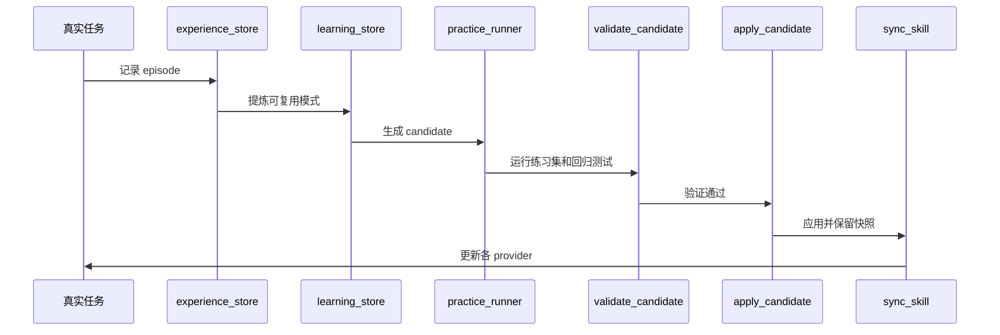

# 架构说明

`skill-router` 把 Skill 管理拆成五个连续层次：

1. 任务澄清
2. Provider 发现与路由
3. 上下文预算
4. 上下文编译
5. 经验、练习与受控进化

## 总览


## 组件

| 组件 | 文件 | 作用 |
|---|---|---|
| 路由入口 | `SKILL.md` | 定义优先级、澄清、路由和输出协议 |
| Provider 发现 | `scripts/provider_roots.py` | 统一发现 Claude、OpenCode、Codex、Cursor、Gemini、Windsurf |
| 聚焦扫描 | `scripts/scan-skills.ps1` | 只输出必要的 Skill 名称、可用性和 provider |
| 上下文预算 | `scripts/context_budget.py` | 让非路由 Skill 退出常驻上下文，支持备份和恢复 |
| 上下文编译 | `scripts/skill_context.py` | 按任务生成最小上下文包，包含章节、reference 索引和行号 |
| 经验记录 | `scripts/experience_store.py` | 记录 episode，生成 scorecard，按任务查询相关经验 |
| 练习与比较 | `scripts/practice_runner.py` | 运行 practice suite，比较升级前后的通过率、耗时和 token |
| 学习记录 | `scripts/learning_store.py` | 记录失败、成功、来源和候选更新 |
| 验证 | `scripts/validate_candidate.py` | 校验候选更新和 Skill 结构 |
| 应用 | `scripts/apply_candidate.py` | 快照、策略检查、应用候选变更 |
| 同步 | `scripts/sync_skill.py` | 多 provider 同步和覆盖前备份 |

## 路由流程

### 1. 澄清

在任何 Skill 调用前，检查：

- 输出物是否明确
- 输入是否可用
- 目标 provider 是什么
- 验收条件是什么
- 是否涉及授权、安全或隐私边界

不清楚就提问，不进入扫描阶段。

### 2. 发现

`provider_roots.py` 提供统一目录映射，并支持环境变量覆盖：

```text
CODEX_SKILLS_PATH
OPENCODE_SKILLS_PATH
CLAUDE_SKILLS_PATH
CURSOR_SKILLS_PATH
GEMINI_SKILLS_PATH
WINDSURF_SKILLS_PATH
```

### 3. 聚焦扫描

扫描默认只输出：

- Name
- Availability
- Providers

只有在需要时才展开描述、路径和原始条目。

### 4. 路由

评分顺序：

1. 用户明确指定
2. 文件类型匹配
3. 领域工作流匹配
4. 任务阶段匹配
5. 当前 provider 可用

### 5. 上下文预算

将非路由 Skill 设置为用户调用，使其 description 不再进入每轮请求。

### 6. 上下文编译

为目标 Skill 生成 query-scoped context pack：

- 相关章节直接加载
- 无关章节只保留标题、行号和 token
- references 只保留索引，必要时再展开

## 进化流程



## 安全模型

默认策略是 `propose`：

- 可以记录
- 可以生成候选
- 不自动修改已安装 Skill

以下变更默认停用自动应用：

- 扩大权限
- 删除大量内容
- 引入未验证脚本
- 改变安全边界
- 无法重复验证

每次应用前创建快照；每次同步前备份目标版本。

## 可观测性

系统保留：

- learning records
- experience episodes
- practice reports
- validation reports
- apply reports
- sync backups

这些记录使 Skill 的成长轨迹可以被审计，而不是只留下“感觉更好了”。
